# Operations UI v2 共用產品邏輯骨架

決策：`PF-20260822-WORK-CORE`。本分支不新增角色、enum、RLS 或 migration。`profiles.role` 現有值只投影為 `STAFF`、`SUPERVISOR`、`ADMIN`；文字需求中的 OWNER 是獨立待決策 persona，未知角色採 STAFF 最小權限投影。

## 分層

1. `pilot-backend.js` 是 Supabase adapter，只讀寫真實 Pilot tables，query error 一律向上拋出。
2. `work-domain.js` 是無 UI、無網路的 domain/selector：Task、Count、Inventory Event、Exception、角色可見範圍與狀態 guard。
3. `work-components.js` 提供任務卡、狀態標籤、空／錯誤／離線、固定底部動作等共用輸出。
4. `operations-ui-v2.js` 只負責角色首頁 view-model，不重新定義權限或資料規則。
5. `app.js` 組合 adapter、selector 與 component；正式 cloud mode 不使用 localStorage 或 Demo fallback 作資料來源。

## 共用不變條件

- STAFF 只取得指派給自己或未指派的盤點工作。
- SUPERVISOR selector 只回傳待核對或有未解異常的工作；正常資料收起。
- ADMIN 使用同一工作流，增加組織範圍與設定動作，不複製 domain。
- 0 是已盤；空字串是未盤；負數／非數字不可完成。
- 全區域完成前不能完成 session 或開啟差異。
- `count_entries`、OCR runs、corrections 等原始事件只追加；domain event 永遠保存 source、actor、time、raw record。
- 收貨 OCR REVIEW／UNREADABLE 由 adapter 投影為同一 Task／Exception stream。

## 垂直流程

```mermaid
flowchart LR
  A[STAFF Auth / profiles.role] --> B[loadWorkContext]
  B --> C[今日 COUNT Task]
  C --> D[依 sort_order 選 Zone]
  D --> E[盲盤 Entry]
  E -->|debounced upsert| F[count_drafts]
  F --> G[完成 Zone]
  G -->|append| H[count_entries INITIAL_COUNT]
  H --> I[count_zone_progress COMPLETED]
  I -->|所有 Zone 完成| J[session COMPLETED]
  J --> K[discrepancy selector]
  K --> L[SUPERVISOR 只看差異]
```

真實 authenticated 寫入截圖必須在非 production Supabase 驗證環境完成；若只有 production，不以正式資料做測試。
